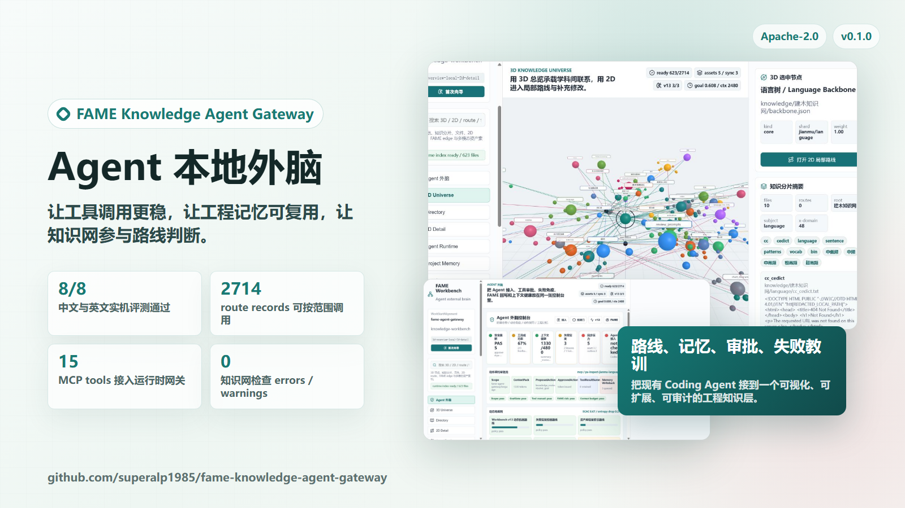
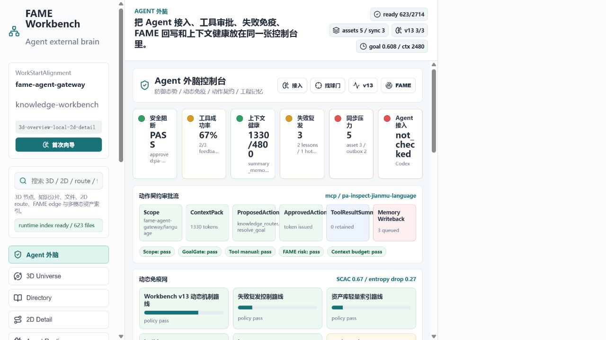
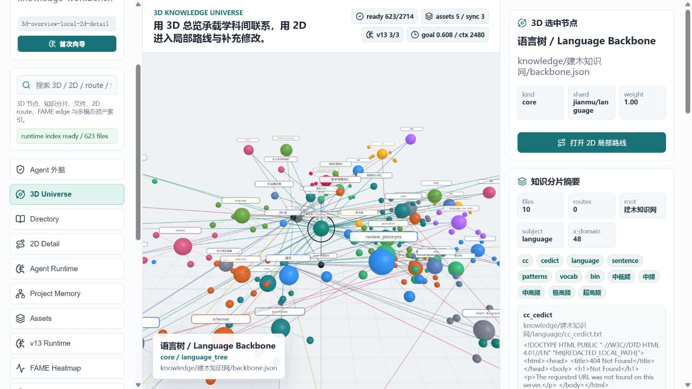
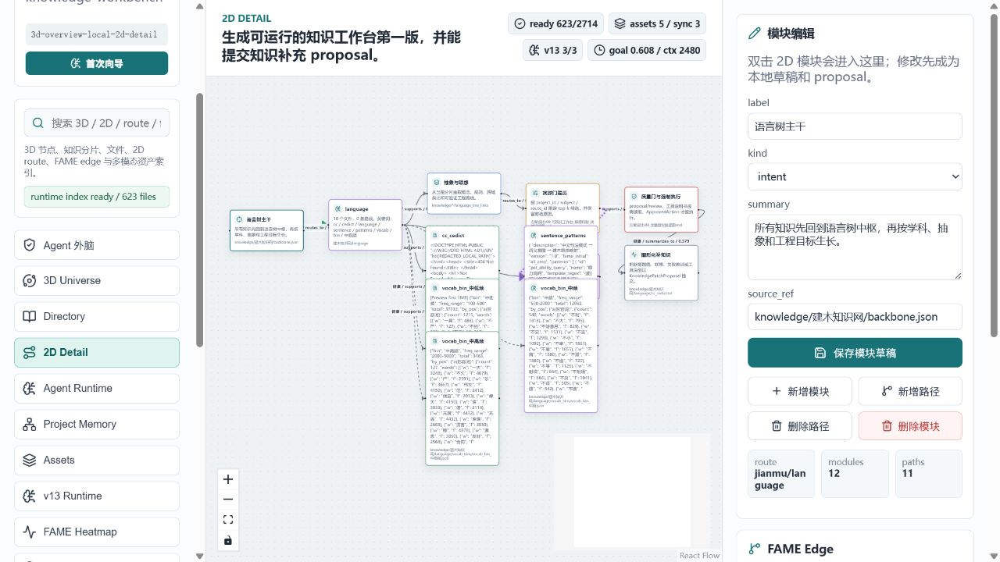
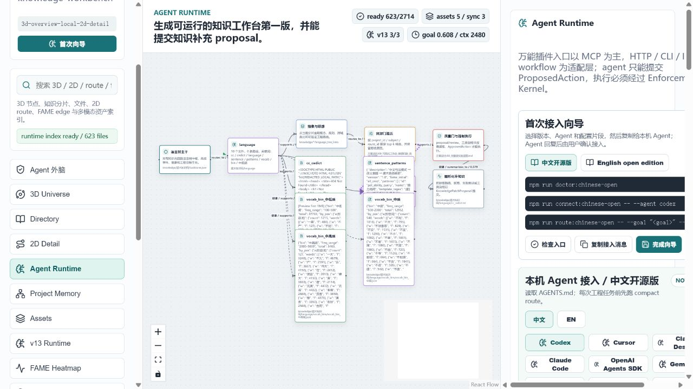
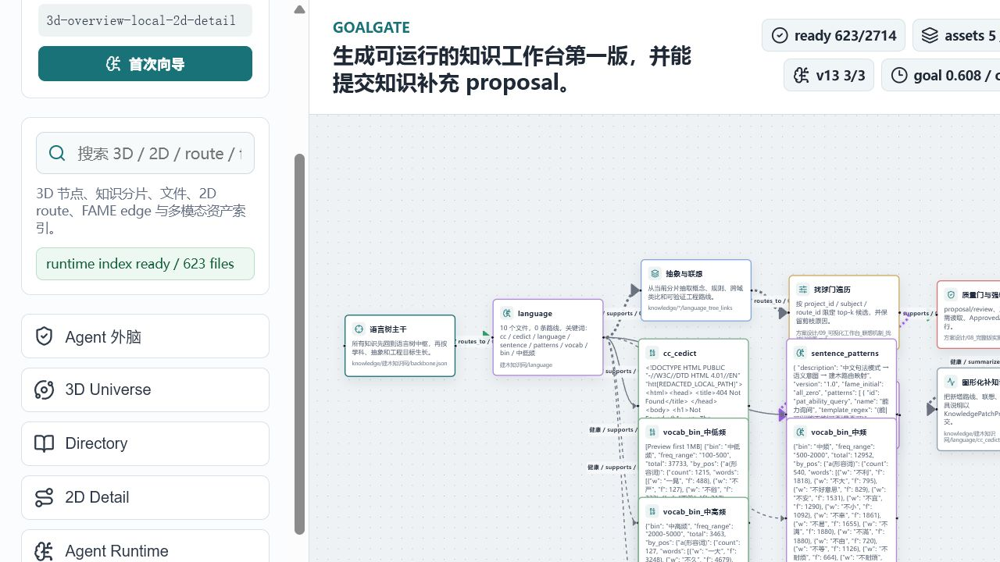

# 我做了一个给 Agent 用的本地外脑：让它少犯工具调用错误，并把工程经验变成可复用记忆

> 项目地址：
> https://github.com/superalp1985/fame-knowledge-agent-gateway
>
> Release：
> https://github.com/superalp1985/fame-knowledge-agent-gateway/releases/tag/v0.1.0



这段时间我一直在做一个有点“不像普通应用”的开源项目：**FAME Knowledge Agent Gateway**。

它不是新的聊天机器人，也不是又一个 RAG 检索库。我更愿意把它叫做一个给现有 Agent 用的**本地外脑**。

先用最直观的话说，它的作用是：

```text
让 Agent 在真实工程里少犯工具调用错误，
把成功路线和失败教训记到外部系统，
每次任务只取需要的知识和上下文，
并且让私人/团队知识资产可以长期沉淀。
```

如果你现在用 Codex、Claude Code、Cursor、OpenAI Agents SDK、Gemini CLI、OpenHands、SWE-agent、Aider 这类工具，它可以放在旁边做四件事：

- **任务开始前**：帮 Agent 对齐目标、项目、科目、路线和上下文预算。
- **调用工具前**：检查路径、作用域、工具说明书、危险操作和审批 token。
- **失败之后**：把错误签名、失败原因、修复路线写回，避免下次重复踩坑。
- **项目做久以后**：把工程经验沉淀为 Project Memory overlay，不污染公共知识网。

## 0. 先看实测结果：它不是概念图

我在本机重新跑了一组检查。当前版本的实测结果如下：

```text
中文开源版知识网检查：
- 111 个文件
- 45 个图节点
- 84 条图边
- 48 条路线
- 104 个内容单元
- 62 个来源
- errors 0 / warnings 0

中文开源版实机评测：
- 8/8 通过
- route_accuracy_proxy = 1
- tool_safety_pass_rate = 1
- 高风险删除：没有作用域时阻断
- 有作用域的高风险删除：仍要求 ApprovedAction
- Git 脏工作区：能识别并阻断未完成契约
- PowerShell 中文乱码探测：通过
- 本机 Agent 接入检查：ready
- 失败复发防护：通过

英文版实机评测：
- 8/8 通过
- 与中文版同样通过工具安全、PowerShell、Agent 接入、失败复发防护

Runtime Gateway 烟测：
- HTTP health = ready
- 未授权请求 = unauthorized
- 无 approval token 的工具调用 = blocked
- 篡改 approval token = blocked
- MCP 初始化成功
- 暴露 15 个 MCP tools
- semantic_results = 5
- trace_spans = 50
- event_count = 564

工作台索引生成：
- 623 个 indexed files
- 2714 条 route records
- 3337 条 runtime entries
- 51 个 shards
- 235 个 3D universe nodes
- 287 条 links
- 5 个多模态资产索引
- 4 条保留记忆
```

这里面我最看重的不是“节点多”，而是这几个结果：

- 危险删除没有声明工作目录和目标范围时会被阻断。
- 即使声明了范围，也必须进入 `ApprovedAction` 流程。
- Git 工作区已经有修改时，系统会提醒 Agent 不能当成干净环境继续操作。
- PowerShell 编码问题会被识别，不会让 Agent 在乱码输出里继续瞎判断。
- 第一次因为错误工作目录跑 `npm test` 失败后，系统会记录失败签名；重试时触发失败复发防护，回到正确工作目录再执行。
- 外部 Agent 接入消息里包含语义锚点和摘要契约，不是只给一段口号。

所以它当前最实际的价值可以概括成一句话：

**在 Agent 真正动手改工程、跑命令、查知识、写记忆之前，先给它一套可执行的路线和刹车。**

我遇到的问题很具体：现在的 Coding Agent、工具调用 Agent 已经很强，它们大多数时候知道自己要调用什么工具，也知道命令大概怎么写。但一到真实工程里，问题就来了：

- 上下文太长，前面的工程判断被挤掉。
- 工具调用参数、路径、shell 语法偶尔会错。
- 同一个坑，Agent 下次还可能再踩一次。
- 项目做久了以后，很多“为什么这么做”的路线消失在聊天记录里。
- 知识库如果只是检索，就很难参与抽象、联想和全局控制。

所以这个项目想解决的不是“让模型知道更多知识”，而是让 Agent 在工程里多一层外部机制：

```text
目标
-> 限定项目、科目、路线
-> 进入语言树和知识网
-> 做抽象与联想
-> 用 FAME 参数评估路线
-> 打包健康上下文
-> 提出工具动作
-> 网关审批
-> 执行工具
-> 记录结果、失败、证据和教训
```

简单说：**不要把所有东西都塞进模型上下文，而是把知识、路线、失败教训和工具约束放到外部系统里。Agent 每次需要时按范围调用，用完后把摘要和证据写回。**

## 1. 先说定位：它和现在的 Agent 记忆、RAG、知识管理工具有什么不同

写这篇之前，我又系统看了一下现在网上比较接近的方向。大概可以分成几类：

- **Agent 长期记忆层**：比如 LangGraph / LangMem、Mem0、Zep。
- **知识图谱增强 RAG**：比如 Microsoft GraphRAG。
- **Agent 工具协议和安全机制**：比如 MCP、OpenAI Agents SDK 的 guardrails / human review、LangGraph 的 human-in-the-loop。
- **个人知识库和源材料问答**：比如 Obsidian、Logseq、NotebookLM、Anytype。

这些项目都很有价值，而且很多设计我也认真借鉴了。但 FAME Knowledge Agent Gateway 想站的位置不完全一样。

**Mem0、LangMem 这类系统更像“记忆层”。** 它们重点解决 Agent 跨会话记住用户偏好、事实、对话经验、行为模式的问题。这个方向非常重要。但我这个项目更强调工程执行路线：Agent 面对一个真实工程任务时，先进入哪条知识路线、哪些工具需要审批、失败经验如何变成下一次阻断、上下文如何裁剪，这些都是记忆层之外的问题。

**Zep / Graphiti 很接近“动态图谱记忆”。** Zep 的 temporal graph、Graphiti 的实时增量知识图谱，和我的目标有相当多共鸣。区别在于，我这里不是只做一个图数据库或图检索层，而是把“语言树中枢、学科抽象层、FAME 路线参数、工具调用审批、项目记忆 overlay、可视化编辑入口”捆成一个本地 Agent 外脑工作台。后续如果要增强图存储，Graphiti 这类项目完全可以作为后端借鉴甚至接入。

**GraphRAG 更偏“从文档生成图谱，然后辅助问答”。** 它很适合让模型理解大规模私有文档里的实体、关系和社区摘要。但 FAME Gateway 的重点不是问答，而是 Agent 执行工程时的路线控制：目标是什么，图遍历范围是什么，哪些上下文进入模型，哪些工具可以执行，失败以后如何写回。

**MCP、OpenAI Agents SDK、LangGraph HITL 更像“协议和控制能力”。** 它们解决 Agent 如何连接外部工具、如何做 guardrails、如何让人类审批敏感动作。我的项目不想替代这些标准，而是想成为这些标准之上的一个本地知识与工程记忆插件：MCP 可以当连接层，guardrails 可以当执行层，FAME Gateway 负责提供“该走哪条路线、为什么、风险在哪里、失败教训是什么”。

**Obsidian、Logseq、NotebookLM、Anytype 这类工具更偏人的知识管理。** 它们适合人整理笔记、构建个人知识库、基于资料问答。但我的目标用户首先是 Agent：知识网的结构、路由、摘要、失败签名、工具说明书、上下文预算，都要能被 Agent 直接读取和执行。

所以这个项目真正的定位可以更准确地说成：

```text
一个本地优先的 Agent 外部工程治理层：
用可扩展知识网提供抽象和联想，
用 FAME 路由参数保留成功和失败经验，
用 Tool Gateway 约束工具调用，
用项目记忆 overlay 沉淀私人和团队工程资产。
```

它不是要和现有 Agent 框架抢位置，而是给它们加一层“工程大局观 + 记忆 + 工具防护”。

## 2. 它首先是一个 Agent 外脑控制台



上图是当前工作台首页。它把几个原本分散的东西放到同一张控制台里：

- Agent 是否接入。
- 当前工具动作是否安全。
- Action Contract 审批流是否通过。
- 失败签名是否重复出现。
- 上下文预算是否健康。
- 记忆写回队列是否还有未同步内容。
- FAME 路线参数是否说明某条路线风险过高。

我把这里叫做“防御态势大屏”，但它不是装饰性的 dashboard。它背后对应的是一个很朴素的工程约束：**Agent 不能只凭当前上下文直接乱跑工具。**

尤其是对会改文件、跑脚本、调用 shell、同步数据库的 Agent 来说，“调用工具前先看说明书、先确认路径和作用域、先生成 ProposedAction，再拿 ApprovedAction 去执行”，这个机制比单纯多喂一点 prompt 有用得多。

## 3. 知识网不是检索库，而是按语言树、抽象层和学科路线组织



这个项目里有一个 3D/2D 图谱工作台。3D 不是为了炫技，而是因为知识网如果稍微大一点，二维树很快就会看不出结构。

当前设计里，中间是**语言树中枢**。专业知识不是平铺在旁边，而是围绕语言树生长：

```text
语言树
-> 意图
-> 术语
-> 抽象概念
-> 学科路线
-> 具体工具与工程动作
-> 验证方式
-> 失败教训
```

这样做的原因是：Agent 处理工程问题时，很多错误并不是“不知道某个知识点”，而是没有先理解这个问题在语言和抽象层面到底属于什么。

比如一个用户说“PowerShell 中文乱码”，它不只是一个终端问题。它可能同时关联：

- shell 编码。
- Windows 控制台。
- Node 脚本输出。
- Git CMD 与 PowerShell 差异。
- 文档写法。
- Agent 工具调用前置检查。

如果知识网只是关键词检索，Agent 可能只拿到一条命令。但如果按路线组织，它应该先判断“这是工具调用稳定性问题”，再进入 PowerShell 路由，再结合本工程的失败记录，最后生成更稳的动作。

## 4. 大图看全局，局部用 2D 图编辑



3D 图适合看全局，但不适合精细编辑。所以系统里有 2D Detail 视图，用来处理某一条路线、某一个模块、某一组路径。

现在 2D 视图里可以直接编辑模块，并且可以增加、修改、删除路径和模块。这个入口很重要，因为开源知识网不可能由一个人一次性写完。真正合理的方式应该是：

- 核心项目提供结构、协议和种子知识。
- 用户和社区逐步补充专业知识。
- 每次修改都可以同步数据库索引。
- 项目记忆可以作为 overlay 存在，不污染核心知识网。

也就是说，图谱不是静态展示，而是知识系统本身的编辑入口。

## 5. 它保留失败教训，而不是只记成功经验

项目里路线边带了一组 FAME 参数：

```text
mu       有效性
chi      探索价值
epsilon  与目标和语义的贴合度
kappa    置信度
nu       风险和不确定性
delta    逻辑冲突
rho      资源和上下文压力
lambda   失败教训权重
```

这里面最关键的是：**失败不是垃圾。失败是一种带权重的路线记忆。**

如果某条工具调用路线失败过，系统不应该简单把它删除。更好的做法是把它标记为负向经验：什么时候会失败，失败签名是什么，下一次遇到类似问题时应该先检查什么。

这对 Agent 很实用。因为 Agent 最烦人的问题之一就是：这次因为路径错失败了，下次换个上下文它还能再错一遍。

所以我在系统里加入了失败签名、动态免疫网、FAME 负值路线显示、记忆写回队列这些东西。目标不是让 Agent “永远不犯错”，而是让它**犯过的错能变成下一次的防护层**。

## 6. Agent 接入做成插件，而不是绑死某一个模型



这个项目的定位不是替代 Codex、Claude Code、Cursor、OpenAI Agents SDK、Gemini CLI、OpenHands、SWE-agent、Aider 这些工具。

相反，它更像一个外部插件：

```text
已有 Agent
-> 读取 AGENTS.md / 接入消息
-> 请求 scoped route
-> 获取 context pack
-> 提交 ProposedAction
-> 通过 Tool Gateway 执行
-> 写回 ToolResultSummary / Memory
```

这样做有两个好处。

第一，不押注单一 Agent。哪怕明天出现新的 Agent，只要它能读协议、能调用 HTTP/MCP 或者能按说明执行流程，就可以接进来。

第二，外部记忆不绑在一次聊天上下文里。模型上下文可以释放，日志、证据、失败教训、项目路线仍然留在本地系统中。

## 7. “找球门”：图遍历必须有目标和范围



图谱系统很容易走向另一个极端：东西越接越多，最后遍历爆炸。

所以这个项目里有一个我自己很喜欢的概念：**找球门遍历**。

意思是 Agent 不应该无边界地扫完整个图，而是先确定：

```text
project_id
subject
route_id
task_id
goal
context_budget
```

然后只在这个范围里做 top-k 路线选择。没有被选择的边不进上下文，只留下摘要、引用和剪枝理由。

这件事对大项目很关键。因为 Agent 不是没有知识，而是很容易被太多知识淹没。

## 8. 知识网开源扩展：项目不应该只属于一个人的知识

这个项目开源以后，我最希望被社区扩展的不是 UI，而是知识网。

但这里的扩展不是“大家随便往里面塞资料”。知识网要遵守一套组织方式：

```text
语言树中枢
-> 学科
-> 抽象层
-> 路线
-> 具体知识点
-> 工具说明书
-> 验证方法
-> 失败教训
-> FAME 参数
```

也就是说，一个新知识点不能只是一个孤立 Markdown。它最好说明：

- 它属于哪个 subject。
- 它挂在哪条 route 上。
- 它和语言树哪个意图、术语、抽象概念有关。
- 它解决什么工程问题。
- 它需要哪些工具。
- 它怎么验证。
- 它失败过会留下什么教训。
- 它的 FAME 初始参数应该如何设置。

这样社区扩展出来的就不是“资料堆”，而是一张 Agent 可以遍历、可以裁剪上下文、可以参与工具调用决策的知识网。

我觉得这是开源版最有意义的地方：**每个人都可以给 Agent 补知识，但补进去的知识要能进入工程路线，而不只是变成搜索结果。**

## 9. 私人的知识资产：公共知识网之外，还应该有自己的工程记忆

开源知识网解决的是通用问题，比如编程、工具调用、PowerShell 易错点、Agent 接入方式。

但每个人、每个团队真正值钱的东西，往往不是通用知识，而是自己的工程经验：

- 这个项目为什么采用某个架构。
- 某条命令在本机为什么不能这样跑。
- 某个依赖升级时踩过什么坑。
- 某个客户、业务、代码库有哪些特殊约束。
- 某个 Agent 在这个项目里反复犯过哪些错误。
- 哪些路线已经验证有效，哪些路线虽然失败但值得保留为教训。

所以系统里专门设计了 **Project Memory overlay**。它和核心知识网分开：

```text
公共知识网：通用、可开源、可社区维护
项目记忆：私有、和具体工程绑定、默认不污染公共知识网
私人资产库：文档、截图、日志、多模态材料放在数据库或对象存储，知识网只保留索引和预览
```

这样就能形成一套很实用的私人知识资产建设方式：

1. 公共知识网提供基本路线和工具安全规则。
2. 私人项目记忆记录真实工程过程。
3. 多模态资产存在数据库或对象存储里，知识网只做轻量索引。
4. 成功经验、失败教训和人工复盘都写回 FAME 路线。
5. 只有经过审核的私人经验，才可以晋升为团队知识或开源知识候选。

这对长期工程很重要。因为聊天记录会消失，上下文会压缩，但一个团队真正的工程资产应该留下来，而且要能被下一个 Agent 继续使用。

## 10. 当前开源版重点放在“编程 + 工具调用”

我没有把所有学科都塞进开源版。现在的开源种子知识重点是：

- 编程。
- 工具调用。
- PowerShell / shell 容易出错的地方。
- Agent 接入协议。
- 工程记忆。
- 上下文健康。
- 知识图谱编辑和同步。

这也是我觉得最适合开源第一版的范围。因为它可以直接服务现有 Coding Agent，而且效果比较容易验证：工具调用成功率、重复失败降低、上下文节省、工程记忆复用，这些都能测。

其他学科当然可以继续扩展，但应该交给后续社区慢慢补。核心结构先稳住，比一开始追求大而全更重要。

## 11. 怎么使用

我单独整理了一份更完整的使用说明书：

```text
docs/marketing/使用说明书.zh-CN.md
```

第一次使用可以按这个顺序：

```text
1. 下载 portable zip
2. 运行 start.ps1
3. 打开 http://127.0.0.1:5178/
4. 看 Agent 外脑首页是否 ready
5. 进入 Agent Runtime
6. 选择自己的 Agent
7. 复制接入消息给 Agent
8. 跑一次 route:chinese-open --compact
9. 让 Agent 执行一个小任务
10. 看 ToolResultSummary 和失败教训是否写回
```

仓库地址：

https://github.com/superalp1985/fame-knowledge-agent-gateway

Release 下载：

https://github.com/superalp1985/fame-knowledge-agent-gateway/releases/tag/v0.1.0

Windows 一键启动：

```powershell
.\start.ps1
```

或者：

```bat
start.bat
```

手动方式：

```bash
npm run install:all
npm run generate:all
npm run dev
```

打开：

```text
http://127.0.0.1:5178/
```

Runtime Gateway：

```bash
npm run gateway
```

MCP stdio Gateway：

```bash
npm run gateway:mcp
```

## 12. 目前它还不是终点

这个项目现在更像一个可以运行的基础设施雏形。它已经有：

- 3D/2D 知识图谱工作台。
- 中文开源版和英文版。
- Agent 接入向导。
- Tool Gateway。
- FAME 路线参数。
- 项目记忆 overlay。
- 多模态资产轻量索引。
- portable zip 和一键安装脚本。
- Docker / GitHub Release 基础发布流程。

但真正重要的下一步不是疯狂加功能，而是把知识网内容做得更准、更规范、更能帮 Agent 在真实工程里少犯错。

我现在的判断是：Agent 时代可能不缺“更会说话的模型”，但会越来越需要一种外部工程记忆层。它不替模型思考，但它能帮模型：

- 记住做过什么。
- 知道哪些路线成功过。
- 避开以前失败过的路径。
- 在调用工具前先对齐说明和作用域。
- 用有限上下文处理更长周期的工程。

如果说现在的 Agent 像一个很聪明但容易忘事、偶尔手滑的工程师，那么这个项目想做的就是它旁边那本会自动更新的工程路线本。

不是让它变得神奇，而是让它变得稳。

## 参考调研

这些项目和文档是我判断定位时重点参考的方向：

- LangGraph Persistence / long-term memory：https://docs.langchain.com/oss/python/langgraph/persistence
- LangMem：https://langchain-ai.github.io/langmem/
- Mem0：https://docs.mem0.ai/platform/overview
- Zep / Graphiti：https://help.getzep.com/graphiti/getting-started/overview
- Microsoft GraphRAG：https://microsoft.github.io/graphrag/
- Model Context Protocol：https://modelcontextprotocol.io/docs/getting-started/intro
- OpenAI Agents SDK guardrails and human review：https://developers.openai.com/api/docs/guides/agents/guardrails-approvals
- Logseq：https://logseq.com/
- NotebookLM：https://notebooklm.google/
- Anytype：https://anytype.io/
