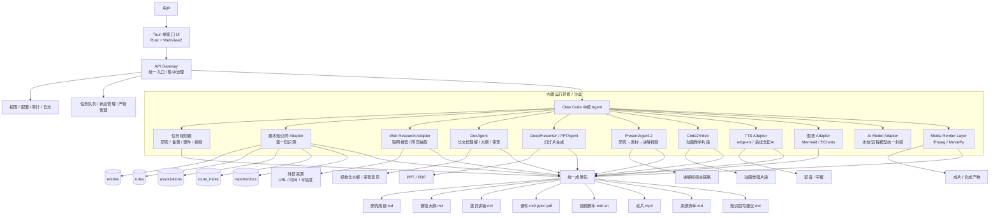

# 建木 Agent Studio 总架构图（v0.2）

## 核心原则
1. 用户只面对 Tauri 单窗口。
2. API Gateway 是唯一入口，负责集中治理。
3. Claw Code 是中控，负责调度工具和整合成果。
4. 建木知识网是第一知识源。
5. Web 搜索只做补充证据，默认不入库。
6. DocAgent / DeepPresenter / PresentAgent-2 / Code2Video 都是后台模块，不是主脑。
7. 环境随应用一起封装，目标是装到哪台电脑都能用。
8. 视频主链路优先 PresentAgent-2，动画增强交给 Code2Video。
