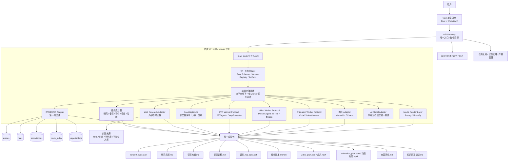

# 建木 Agent Studio 总架构图（v0.3）

## 核心原则
1. 用户只面对 Tauri 单窗口。
2. API Gateway 是唯一入口，负责集中治理。
3. Claw Code 是中控，负责调度工具和整合成果。
4. **统一任务协议层先于具体 worker**：先定义 schema、registry、artifact，再接 PPTAgent/PresentAgent-2/Code2Video 等重模块。
5. **审计前置**：Claw Code 把文字交给下一级 worker 前就生成 handoff audit，不等成品出来。
6. v0.1 审计默认 non-blocking：先记录/告警，优先保证模块集成速度。
7. 建木知识网是第一知识源。
8. Web 搜索只做补充证据，默认不入库；入库必须生成建议并人工确认。
9. Doc/PPT/Video/Animation 都是后台 worker，不是主脑。
10. 环境随应用一起封装，目标是装到任意电脑都能用。

## 当前 v0.1 已接 API
- `GET /health`
- `GET /workers`
- `GET /workers/{worker_name}`
- `POST /documents/outline`
- `POST /ppt/draft`
- `POST /video/plan`
- `POST /animation/plan`
- `POST /tasks/course-pack`

## 近期接入顺序
1. 保持协议层稳定。
2. 给每个 worker 补 dry-run / plan-only 模式。
3. 再接真实重依赖：PPTAgent、PresentAgent-2、Code2Video、TTS、ffmpeg。
4. 最后做 Tauri UI 封装与运行时打包。
