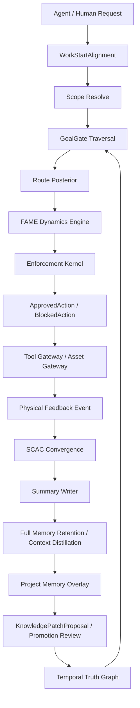

# 理论论文与外部调研 v13 机制改进建议

日期：2026-06-27

## WorkStartAlignment

```yaml
project_positioning: Agent 万用外部插件 / 外脑运行时 / 工具治理网关
current_task: theory 论文审查 + 外部开源路线调研 + 项目机制改进建议
active_scope:
  project_id: fame-agent-gateway
  subject: theory-review
  route_id: theory-research-mechanism-upgrade
  task_id: theory-review-v13-recommendations
active_goal_gate:
  goal_type: update_knowledge
  success_condition: 从 FAME、Onto-plasticity、SCAC 论文和当前开源路线中找出可落地机制改进，给出优先级、公式、schema 和实现方式
required_modules:
  - fame_dynamics_engine
  - scac_feedback_convergence
  - full_memory_retention_engine
  - context_distillation_engine
  - temporal_truth_graph
  - plugin_enforcement_gateway
  - evaluation_harness
enforcement_required: true
context_budget_strategy: summary_first
```

## 1. 本轮结论

当前 Workbench v12.1 已经具备知识网可视化、Project Memory Overlay、多模态轻量索引、Asset DB Sync Preview、GoalGate 与 Agent Runtime 预览。论文和外部调研看完后，下一步不应继续堆“更多搜索功能”，而应把三个理论核心落成运行时机制：

```text
FAME: 从静态边权升级为时间序列情绪动力学。
SCAC: 从经验式质量门升级为可测量的物理反馈收敛。
Onto-plasticity: 从上下文堆积升级为全量记忆保留、上下文蒸馏和项目人格化路由偏好。
```

这三点能让系统明显区别于 GraphRAG、Graphiti、Mem0、LangGraph、MCP 工具网关等现有项目：别人主要解决检索、记忆、执行和连接；本项目要解决“抽象联想路线如何在真实工程反馈中持续变得更可靠”。

## 2. theory 论文映射

### 2.1 FAME 论文

论文中的 8 维 AI 情绪向量可直接作为路线状态：

```text
E_AI = (mu, chi, epsilon, kappa, nu, delta, rho, lambda)^T
```

当前项目已经有 `FAMEEdgeState`，但还偏静态。应补成时间序列：

```yaml
FAMETimeseriesPoint:
  point_id: string
  edge_id: string
  route_id: string
  project_id: string
  observed_at: datetime
  event_ref: string
  fame: { mu, chi, epsilon, kappa, nu, delta, rho, lambda }
  target_fame: { mu, chi, epsilon, kappa, nu, delta, rho, lambda }
  inertia_xi: float
  update_reason: success|failure|conflict|stale|verified|manual_review|quality_gate
  evidence_refs: list
```

推荐工程更新式：

```text
E(t+1) =
  clip(
    E(t)
  + eta * (1 - xi) * (E_target(t) - E(t))
  + beta * r_event(t)
  - gamma * stale_penalty(t),
    0, 1
  )
```

惯性估计：

```text
xi_hat =
  clamp(
    1 - sum(<DeltaE_i, D_i>) / (sum(||D_i||^2) + eps),
    0, 1
  )
```

含义：

```text
xi 高：路线稳定，不因一次成功/失败剧烈改变。
xi 低：路线易变，近期证据会快速改写状态。
```

### 2.2 SCAC 论文

SCAC 的关键不是“多想几遍”，而是用真实反馈让语义状态收敛。项目里应把 lint/build/test/browser/tool result/human review 变成 `PhysicalFeedbackEvent`：

```yaml
PhysicalFeedbackEvent:
  event_id: string
  trace_id: string
  project_id: string
  route_id: string
  action_id: string
  feedback_type: lint|build|test|browser|tool_result|human_review|asset_verify
  status: pass|fail|partial|blocked
  distance_before: float
  distance_after: float
  kappa_scac: float
  posterior_entropy_before: float
  posterior_entropy_after: float
  feedback_gain: float
  evidence_refs: list
```

收敛系数：

```text
kappa_scac = distance_after / max(distance_before, eps)
```

解释：

```text
kappa_scac < 1: 反馈让工程状态更接近球门。
kappa_scac >= 1: 这条路线没有收敛，需要重定 scope、换路由或人工确认。
```

Bayesian 路由后验：

```text
p_{t+1}(route_i) =
  normalize(
    p_t(route_i)
  * Phi(feedback_t | route_i)
  * I(policy_pass_i)
  )
```

后验熵：

```text
H_t = - sum_i p_t(route_i) * log(p_t(route_i))
entropy_drop = H_t - H_{t+1}
```

工程规则：

```text
如果 kappa_scac >= 1 且 entropy_drop <= 0，禁止继续惯性执行同一路线。
如果连续两次不收敛，GoalGate 必须生成 re-scope 或 human_review。
```

### 2.3 Onto-plasticity 论文

Onto-plasticity 对本项目最有价值的点是：记忆不应永久平铺在当前上下文里，而应被情绪标记，并按工程价值决定摘要、引用、固定、懒加载或晋升；底层记忆、日志和 trace 全量保留。

情绪标记：

```text
alpha(E, m) =
  (1 / 8) * sum_i w_i * abs(E_i - Ebar_i(m))
```

上下文有效半衰期：

```text
tau_eff(m) =
  base_tau(m)
  * (1 + a1 * alpha + a2 * lambda + a3 * kappa + a4 * human_pin)
  / (1 + b1 * rho + b2 * staleness)
```

上下文注意强度衰减：

```text
context_attention(t + dt) =
  context_attention(t) * exp(-dt / tau_eff)
```

新增 schema：

```yaml
FullMemoryRetentionState:
  memory_id: string
  memory_type: context_summary|route_summary|failure_lesson|tool_summary|asset_index|trace
  scope:
    project_id: string
    subject: string
    route_id: string
  importance: float
  freshness: float
  reuse_count: int
  full_retention: true
  context_action: include_summary|pin_for_goal|lazy_load_raw|audit_only|promote_candidate
  storage_ref: string
  summary_ref: string
  reason: string
```

项目人格化路由偏好：

```yaml
ProjectRoutePersonality:
  project_id: string
  agent_id: string
  stable_route_preferences:
    abstraction_bias: object
    risk_tolerance: float
    exploration_bias: float
    verification_strictness: float
    context_conservation: float
  learned_from_refs: list
  bounded_by_policy: list
```

边界：人格化偏好只能影响 project overlay 和 session 决策，不得直接改核心知识网。

## 3. 外部项目借鉴路线

### 3.1 GraphRAG / LightRAG

GraphRAG 的 global search 使用社区报告处理整体性问题，local search 结合知识图谱结构数据和原始文本片段处理具体实体问题；GraphRAG 还把 community report 作为下游搜索和人工阅读的摘要层。LightRAG 强调知识图谱与向量的双层结构，并用低层/高层双级检索兼顾细节事实和抽象主题。

本项目借鉴：

```text
3D Universe = global/community/subject overview
2D Detail = local route shard
Context Pack = community summary first, raw evidence lazy load
GoalGate Traversal = scoped beam search, not global BFS
```

### 3.2 Graphiti / Zep

Graphiti/Zep 的价值是 temporal knowledge graph：事实、关系、来源和有效性会随时间变化，并支持实时增量更新。

本项目借鉴：

```yaml
TemporalTruthEdge:
  edge_id: string
  valid_from: datetime
  valid_to: datetime|null
  observed_at: datetime
  last_verified_at: datetime
  invalidated_by_ref: string|null
  provenance_refs: list
  fame_state_ref: string
```

这正好对应用户强调的“知识有及时性，有时成功，有时不一定”。

### 3.3 LangGraph

LangGraph 的 persistence 用 checkpointer 支持短期记忆，用 store 支持长期记忆。它适合承载 ClockEvent、resume、human review、replay，但不应替代建木路线选择。

本项目借鉴：

```text
workflow runtime = LangGraph-style state/checkpoint
route decision = 建木知识网 + FAME + GoalGate
project memory namespace = project_id / agent_id / task_id
```

### 3.4 MCP / OpenAI Agents SDK tracing / OpenTelemetry

MCP 的 tools/resources/prompts 适合作为万能插件接口。OpenAI Agents SDK 和 OpenTelemetry 的 trace/span 适合作为全链路观测。

本项目借鉴：

```text
MCP resources:
  route_summary
  fame_edge_state
  context_summary
  asset_index
  project_memory_summary

MCP tools:
  resolve_goal
  route_knowledge
  propose_action
  approve_action
  pack_context
  write_summary

Trace spans:
  WorkStartAlignment
  ScopeResolve
  GoalGateTraversal
  FAMEScoring
  EnforcementDecision
  ToolInvocation
  PhysicalFeedback
  SummaryWrite
```

关键边界：

```text
MCP 负责连接。
Enforcement Kernel 负责允许/阻断。
Tool Gateway 只执行带 approval_token 的 ApprovedAction。
```

### 3.5 Mem0

Mem0 的优势是把记忆做成可持续学习的外部层，并降低重复上下文成本。项目可借鉴其“提取、巩固、检索显著记忆”的方向，但本系统不能退化成偏好记忆库，必须保留建木知识网的抽象层级和 FAME 路由状态。

### 3.6 Outbox / Event Sourcing / JSON Patch / CRDT

用户手动调整知识网并同步数据库时，v12.1 已有 `AssetDbSyncItem`，但还缺更强的一致性模型。

建议：

```text
Event Sourcing:
  KnowledgePatchProposal、AssetDbSyncItem、ApprovedAction、FAMEHistory 全部作为事件追加。

Transactional Outbox:
  知识编辑事件和数据库同步事件先进入 outbox，同步 worker 再投递，避免双写漂移。

JSON Patch:
  每个手动编辑保存为可审计 patch op，而不是不可解释的大块覆盖。

CRDT:
  只用于多人草稿协作层。核心知识网仍然必须串行 review，不自动合并进 core。
```

## 4. 当前项目差距

```text
已实现：
  3D/2D 双层 Workbench
  搜索、route shard、FAME Heatmap、GoalGate 预览
  Project Memory Overlay
  多模态 Asset Store 轻量索引
  Manual Knowledge Edit -> Asset DB Sync Preview
  Agent Runtime 连接形态预览

主要缺口：
  FAME 还没有完整时间序列、惯性估计和校准闭环。
  GoalGate 还没有 SCAC 收敛系数和 Bayesian route posterior。
  Project Memory 还没有全量记忆保留、情绪标记、上下文蒸馏和人格化偏好。
  Enforcement 仍主要是 UI preview，真实 MCP/HTTP Tool Gateway 尚未落地。
  AssetDbSyncItem 尚未升级为 outbox/event-sourced 一致性机制。
  语义自适配仍是轻量 token/keyword，未接 community summaries 或 embeddings。
```

## 5. v13 机制升级优先级

### P0：先补 schema 和指标

```text
新增 FAMETimeseriesPoint
新增 PhysicalFeedbackEvent
新增 RoutePosteriorState
新增 FullMemoryRetentionState
新增 TemporalTruthEdge
新增 TraceSpanEvent
```

原因：这些是后续 UI、数据库、MCP 和评估的共同底座。

### P1：Workbench 可视化补面板

```text
FAME Dynamics:
  显示 E(t)、E_target、xi、freshness、半衰期和 recent event。

SCAC Convergence:
  显示 kappa_scac、entropy_drop、distance_before/after。

Full Memory Retention:
  显示 include_summary/pin_for_goal/lazy_load_raw/audit_only/promote_candidate 队列。

Route Posterior:
  显示候选路线概率变化和被剪枝原因。

Sync Outbox:
  显示 pending/sent/applied/failed/replayable 同步事件。
```

### P2：真实运行时

```text
MCP Server:
  暴露 resources/tools/prompts，但所有执行工具走 Enforcement。

HTTP API:
  给 Workbench 和远端 agent 使用。

Tool Gateway:
  只接受 ApprovedAction + approval_token。

Trace Runtime:
  每次 agent 思考链生成可回放 trace/span。
```

### P3：语义和大图效率升级

```text
GraphRAG-style community summaries
LightRAG-style low/high level retrieval
Graphiti-style temporal truth
embedding + keyword + FAME mixed ranking
```

## 6. 新增评估指标

```text
scac_contraction_rate =
  count(kappa_scac < 1) / total_feedback_events

posterior_entropy_drop_avg =
  avg(H_before - H_after)

non_convergent_route_recurrence =
  repeated(kappa_scac >= 1 route) / total_route_attempts

fame_inertia_calibration_error =
  mean(abs(predicted_E_delta - observed_E_delta))

context_distillation_saving =
  1 - context_loaded_tokens / raw_memory_tokens

useful_memory_retention =
  reused_kept_memories / all_kept_memories

sync_drift_rate =
  unsynced_or_conflicting_asset_indexes / total_asset_indexes

enforcement_bypass_block_rate =
  blocked_bypass_attempts / total_bypass_attempts
```

## 7. 图纸更新建议

后续实现 v13 时，架构图应新增这条闭环：



## 8. WorkEndSummary

```yaml
files_changed:
  - 方案设计/24_理论论文与外部调研_v13_机制改进建议.md
  - 方案设计/04_FAME公式与参数.md
  - 方案设计/05_调研摘要.md
  - 方案设计/07_差异化_遍历效率_评估指标.md
  - 方案设计/09_可视化工作台_联想机制_找球门遍历.md
design_decisions:
  - v13 的核心不是更多检索，而是 FAME 时间动力学、SCAC 收敛、Onto-plasticity 全量记忆保留与上下文蒸馏。
  - 外部项目只借接口、时间图谱、分层摘要、持久化和追踪，不替代建木抽象联想路线。
  - 手动知识编辑和资产库同步应升级为 event-sourced outbox，避免知识图谱和数据库漂移。
diagrams_updated:
  - 本文新增 v13 Mermaid 机制闭环草图，后续实现阶段再同步 02/03/06。
unresolved_questions:
  - 真实 MCP/HTTP Gateway 仍需后续接入外部 agent 执行入口。
next_goal_gate: verify_v13_runtime_full_memory_retention
context_release_summary: 本轮已将 theory 论文和外部调研压缩为 v13 运行时机制，并按用户要求修正为全量记忆保留与上下文蒸馏。
```

## 9. 外部参考

- Microsoft GraphRAG: https://microsoft.github.io/graphrag/
- GraphRAG Global Search: https://microsoft.github.io/graphrag/query/global_search/
- GraphRAG Local Search: https://microsoft.github.io/graphrag/query/local_search/
- HKUDS LightRAG: https://github.com/HKUDS/LightRAG
- LightRAG paper page: https://arxiv.org/html/2410.05779v1
- Graphiti/Zep docs: https://help.getzep.com/graphiti/getting-started/overview
- Graphiti GitHub: https://github.com/getzep/graphiti
- LangGraph persistence: https://docs.langchain.com/oss/python/langgraph/persistence
- MCP tools specification: https://modelcontextprotocol.io/specification/2025-06-18/server/tools
- MCP resources specification: https://modelcontextprotocol.io/specification/2025-06-18/server/resources
- OpenAI Agents SDK tracing: https://openai.github.io/openai-agents-python/tracing/
- OpenTelemetry traces: https://opentelemetry.io/docs/concepts/signals/traces/
- Mem0 GitHub: https://github.com/mem0ai/mem0
- Transactional Outbox: https://microservices.io/patterns/data/transactional-outbox.html
- Event Sourcing: https://martinfowler.com/eaaDev/EventSourcing.html
- RFC 6902 JSON Patch: https://datatracker.ietf.org/doc/html/rfc6902
- Automerge docs: https://automerge.org/docs/hello/
